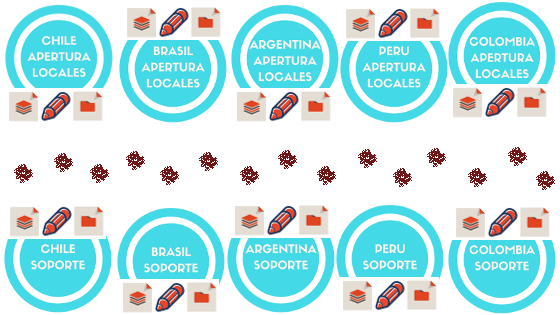
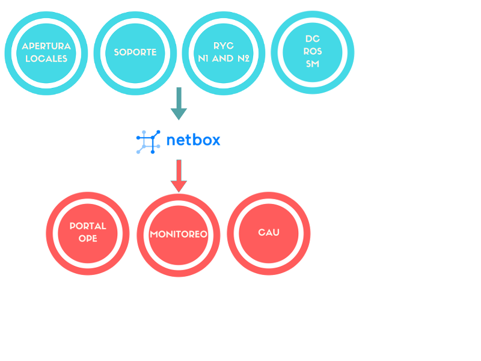

# INTRODUCCIÓN

++

#### Introducción - contexto

Una compañia busca implementar las metodologias de desarrollo con el fin de automatizar procesos hasta lograr en realizar una gran tranformación digital.

Para apoyar estos procesos la compañia adquirio uno de los mejores softwares ya creados.

++

#### Introducción - contexto

Con la nueva metodologia y el nuevo software la compañia busca:
* Mismo frente a cambios diários, obtener información en tiempo real de sus locales físicos. |
* Reforzar el monitoreo de los locales, logrando mapear muchos puntos que hoy no tienen visibilidad. |
* Ordenamiento centralizado de la infraestrutura de TI. |
* Reportes de buena calidad, con alcance regional y actualizados. |

++

#### Introducción - Por Fin

* Mejorar los tiempos de respuesta y la disponibilid de los servicios.
* Lograr tomar desiciones con mejor claridad de la información.

++

#### Introducción - Por Fin

La compañia que es responsable por implementar el software verifica que las informaciones claves y necesarias para el éxito de la solución, ya acordadas antes de la venta, no están, o si están, están desordenadas.
* Los archivos, siempre offline, no estan disponible en ningun lado y no existe ningun plano para ordenar esto. |
* El software que tiene que garantizar el flujo automatizado, y que debe ser implementado en 2 meses tiene gran cantidad de detalles, y el tiempo deberia ser convertido en su configuración. |

++

#### Introducción - Pregunta final

Sín la información principal, y ademas de esto, sin tener como obtener la misma, el software tiene como ser implementado con éxito?

## @fa[angle-down] SI    |    NO @fa[angle-right]

++

#### Introducción - FIN

FIN

--

# Escenario Actual

++

#### Escenario Actual - Equipos

El encenario actual es un extracto de las conversaciones con las areas:
* Apertura de Tiendas
* Soporte Técnico
* Data Center
* Mesa Especializada
* NOC
* Redes y Comunicaciónes (nível 2 y 3)
* Monitoreo

++

#### Escenario Actual - Día a día

* Información descentralizada hasta entre equipos del mismo Pais.
* No se tiene monitoreo de todos los puntos de falla de uno local.
* Los inventários de los Racks están en planillas, lo que dificulta la busqueda y la actualización.
* No hay información completa y de buena calidad acerca de las características de cada local.

++

#### Escenario Actual - ilustración

* lo mismo para RyC y DC ( 20 puntos offlines )

--

# Escenario Futuro

++

#### Escenario Futuro: objetivos macros

* Centralizar la información: con esto se logra disminuir el tiempo en los procesos de busqueda de locales, redes y contactos. |
* Integración con Monitoreo: con esto logramos tener un punto central de información que se replica a reportes, monitoreos, y equipos. |
* Accesibilidad: con esto logramos que uno técnico en campo pueda agregar una balanza, por ejemplo. |
* Inventario detallado de los racks: con esto es posible saber la cantidad de hardware que tenemos y obtener informácion frente a una urgencia. |

++

#### Escenario Futuro - Riesgo!!!!!!

* Nueva metodologia/herramienta sín alcance Regional.
* Procedimiento de ingreso de datos a la herramienta falla frente a uno camibo/cierre/apertura de un local.
* Orden no llegue con claridad hasta el area de soporte.
* Lideres de DC no ingresen los datos de servidores, los contactos o las direciónes.
* RyC no documentan la redes y vlans , no hay camiño para lograr obtener información.

++

#### Escenario Futuro - custo

* custo de software = $0,00.
* custo de mantener la orden = trabajo con responsabilidad.

++

#### Escenario Futuro: Responsabilidades

Una vez que las equipos tengan claro cuanto tiempo y información se pierde
tenendo una estructura offline y fuera de estandar, van buscar mejorar
la calidad de lo que ven haciendo.

La responsabilidad de organizar la información es una tarea que no esta bien
definida y mientras esto no empieze, el esforzo sin inteligencia y el
dolor de cabeza seran aliados de nuestro día a día.

++

#### Escenario Futuro - ilustración

--

# NETBOX

++

##### Where is Netbox?

[NetBox](https://netbox.readthedocs.io/en/latest/) is an open source web application initially conceived by the network engineering team at [DigitalOcean](https://www.digitalocean.com/). Designed to help network management:

* IP addr management (IPAM) - IPs, VRFs, and VLANs
* Equipment racks - Organized by group and site
* Devices - Devices and where they are installed
* Connections - Network, console, power conns
* Virtualization - Virtual machines and clusters
* Data circuits - Long-haul circuits and providers
* Secrets - Encrypted storage of credentials

++

* creators and comunity
* why or why not
* integrations
* automation
* benefits

++

#### netbox - ventajas técnicas

* posibilidad de integración con otras herramientas
 * API y Webhook
* docker
 * LDAP/AD y kubernetes |
* python Django (lenguaje que ya trabajamos) |
 * postgresql - base de datos impecable y sín custo |
* buena interface web |
* open source y con gran cantidad de seguidores/desarrolladores |

--
